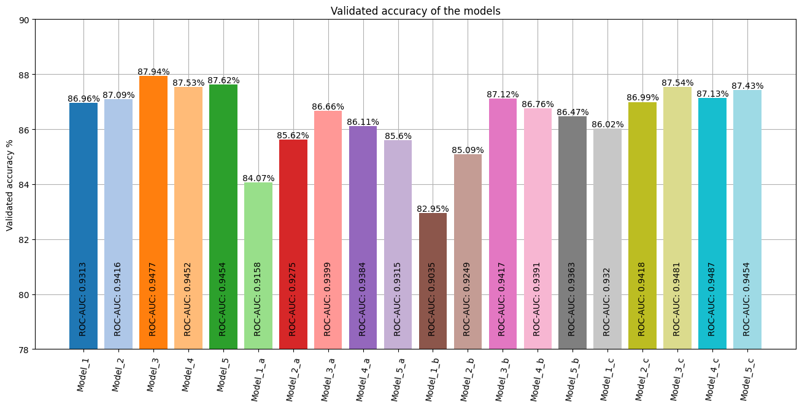

# Модуль 11. Рекурентні нейронні мережі. Tensorflow. Keras.

*З циклу [домашніх завдань Python Data Science](https://github.com/lexxai/goit_python_data_sciense_homework).*

# Домашнє завдання

В якості домашнього завдання вам пропонується створити рекурентну нейронну мережу за допомогою механізмів Keras, яка буде класифікувати рецензії із датасету imdb.

На відміну від прикладу в модулі 9 ми використаємо рекурентну нейронну мережу. Поекспериментуйте з будовою мережі - RNN, LSTM, двостороння та глибока.

Порівняйте результати та зробіть висновки.

# Результати

- [goit_python_ds_hw_11.ipynb](goit_python_ds_hw_11.ipynb)
- [Colab (goit_python_ds_hw_11.ipynb)](https://colab.research.google.com/drive/1Ek5A72JJwciv2sBSPhF-iN3mJOFQWftJ?usp=sharing)

# Висновки

Блок GRU використовує механізми воріт, схожі на ті, що в LSTM, але без комірки пам'яті. Він також має менше параметрів, що робить його обчислювально більш ефективним.

LSTM вирішує проблему зникаючого градієнту, зберігаючи стару інформацію в стані клітини, що дозволяє використовувати її пізніше.

Хоча GRU простіше і обчислювально ефективніше, LSTM є потужнішим і історично більш ефективним.

BRNN знайшли широке застосування в таких задачах, як машинний переклад, класифікація документів, розпізнавання мови, а навіть у деяких аспектах обробки зображень, де послідовні або тимчасові залежності є критичними.

Deep RNN може бути використано в різних областях, таких як обробка природної мови, машинне бачення або прогнозування часових рядів, де важливо розпізнавання складних шаблонів або довгосрочних залежностей в даних.

Основні моделі є 1-5. Також була спроба змінити деякі гіперпараметри у версіях моделей а, b, c. Для цих моделей застосуванно GPU T4, для нормальної роботи з акселерації було застосовано batch-size 512.

---
Модель 3 (LSTM) показала найкращі результати.


## Models compare
Total modlels:  20




## Learning curves


## Confusion matrix
| Model  | Model  | Model  |
|:------:|:------:|:------:|
|  |  |  |
| Model_1 | Model_2 | Model_3 |
|  |  |  |
| Model_4 | Model_5 | Model_1_a |
|  |  |  |
| Model_2_a | Model_3_a | Model_4_a |
|  |  |  |
| Model_5_a | Model_1_b | Model_2_b |
|  |  |  |
| Model_3_b | Model_4_b | Model_5_b |
|  |  |  |
| Model_1_c | Model_2_c | Model_3_c |
|  |  |  |
| Model_4_c | Model_5_c |  |


# Прогноз
```
True: 'With hong kong heart andy and veteran star wan has everything going for it for the beginning part of the movie...' result='Negative'
True: 'To quote one review of the movie it started off slow and stopped the plot was enough although some of the...' result='Negative'
False: 'I have never felt the need to add a review to this website until now but having just sat through the...' result='test: Negative / predict: Positive'
True: 'This movie is not just good its amazing besides providing us with good performances original plot fantastic special effects thoughtful messages...' result='Positive'
True: 'Is the story only russians could tell about the second world war the largest front of the whole conflict has been...' result='Positive'
True: 'In the literal sense br br reminds you of those cops and or indians role playing games you played with your...' result='Negative'
True: 'So the wwe has done it they have over into film their first one being see no evil starring their very...' result='Positive'
True: 'This movie brought together some of the old spinal crew for another film this time revolving around the world of the...' result='Positive'
True: 'When I first got wind of this picture it was just called shepherd and was supposed to be the film that...' result='Positive'
True: 'Clever drama about a wounded union soldier clint eastwood who seeks in an isolated school for young women during the civil...' result='Positive'
False: 'Hi br br I bought this on dvd from england you see I have one of those multi region players I...' result='test: Negative / predict: Positive'
True: 'I don't know why they even kept the name how they could call the series 'the scarlet after they from the...' result='Negative'
True: 'While my kids enjoyed the movie and announced afterward that they want to buy it later I think I got more...' result='Positive'
False: 'This is one of the more movies I have ever seen br br casting richard gere is just too old looking...' result='test: Negative / predict: Positive'
True: 'To say I was disappointed is an understatement an amateur film made by professionals I was about to leave the theater...' result='Negative'
True: 'I didn't know a lot about this film going into it but I did find out that kane was a wrestler...' result='Positive'
True: 'An film that from the back of the box promises twists adventure and an emotional adventure we will never forget this...' result='Negative'
True: 'Most families will similarities between their own family and that created through brilliant acting by natalie portman and susan sarandon natalie...' result='Positive'
True: 'Well what can be said about a horror comedy that features neither horror nor comedy there are no characters in the...' result='Negative'
True: 'All grown up is basically a spin off and not much else of the original cartoon that featured the babies tommy...' result='Negative'
True: 'When a is released from prison his officer has found him a job working at a big city bank when some...' result='Positive'
True: 'The main character is a whiny irresponsible study of how to throw yourself a pity party she loses it at the...' result='Negative'
True: 'From the of the cultural globe four working class teenagers attempted to change the world through music and fashion it was...' result='Negative'
True: 'Wow it's hard to put into words my feelings for this episode ice is one of the best episodes of season...' result='Positive'
True: 'This short was nominated for an academy award losing to anna and not since doctor has nuclear war been so hilarious...' result='Positive'
True: 'I don't think this cartoon was as bad as some may think of course I was only five at the time...' result='Positive'
True: 'Network party she looked at her husband after the preview for 'the played and said this doesn't look like anything else...' result='Positive'
True: 'The movie starts in mexico where a girl has been cursed she on snakes thru green and her friend tries all...' result='Negative'
True: 'I couldn't stop watching this movie though it was far past my br br comparisons to hitchcock are deserved this thing...' result='Positive'
True: 'This film is truly in all script acting plot direction and editing are all uniformly awful I give it 1 out...' result='Negative'
True: 'This has to be one of the worst movies ever to come out of the sci fi channel here is how...' result='Negative'
True: 'This movies made me suffer and I loved it loved it it haunted me for days I think erika is the...' result='Positive'
True: 'This film was a mexican made horror film from the late 60s it's not that good but really not so bad...' result='Negative'
True: 'Everything that you need to know about the pornography of the late 70s and early 80s is all wrapped up in...' result='Positive'
False: 'With the obvious exception of fools horses this was in my opinion david finest series br br coming straight after his...' result='test: Positive / predict: Negative'
True: 'While possibly the stupidest most tasteless and violent slapstick comedy ever made guest house is also a very funny one don't...' result='Positive'
True: 'This is one of my favourite westerns what a cast glenn ford plays his role in his usual mild controlled but...' result='Positive'
True: 'When at the cannes film festival many people didn't like it because they felt it was boring and too slow while...' result='Positive'
True: 'Yet another lo production to completely waste the talents of a young jackie chan to kill with intrigue is a strange...' result='Negative'
True: 'The musical hair is my number one cult movie I do not know how many time I have seen this film...' result='Positive'
True: 'Subject matter quantum physics and stephen br br soundtrack phillip glass br br have I died and gone to heaven br...' result='Positive'
True: 'If you read the plot summary for mad max you've just ruined the first 1 hour and 10 minutes of the...' result='Negative'
True: 'H g war of the worlds by director david michael is a slightly less than average flick which isn't too bad...' result='Negative'
True: 'Is a classic comedy with so many laughs that it's impossible to count br br in what was merely a of...' result='Positive'
True: 'In which two lovers are performing a sex act the camera on erika as she is lost in watching what the...' result='Positive'
True: 'I just finished up this adaptation of h p the lurking fear that was shot in outside of a few changes...' result='Negative'
True: 'A stunningly well made film with exceptional acting directing writing and photography br br a finds married life not what she...' result='Positive'
True: 'Ok when I was little and I mean like 2 or 3 not 6 and 7 barney was one of my...' result='Negative'
True: 'I watched the longer version and could not take my eyes off the screen minutes passed and yet it seemed like...' result='Positive'
True: 'Every moment of this spectacle with music to match is gorgeous but listen to the vocal portion of the 3rd so...' result='Positive'

Accuracy of 50 selections: 92.00%, Accuracy of test dataset: 87.94% [Model_3]
```


