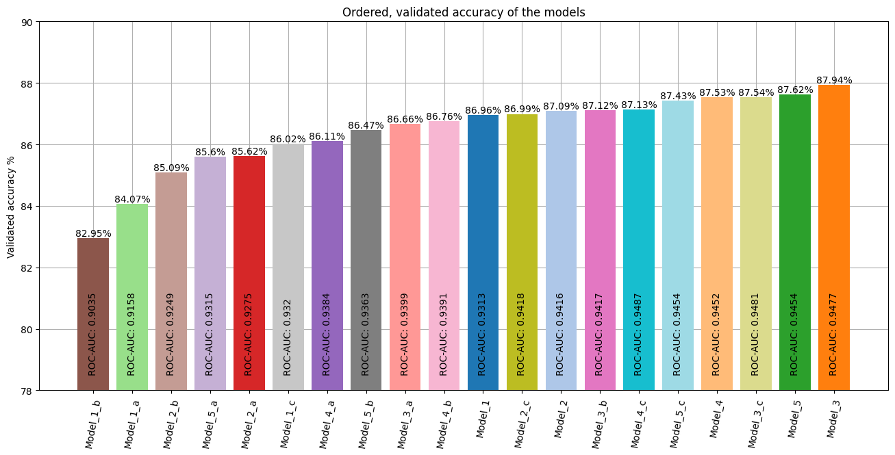

# Модуль 11. Рекурентні нейронні мережі. Tensorflow. Keras.

*З циклу [домашніх завдань Python Data Science](https://github.com/lexxai/goit_python_data_sciense_homework).*

# Домашнє завдання

В якості домашнього завдання вам пропонується створити рекурентну нейронну мережу за допомогою механізмів Keras, яка буде класифікувати рецензії із датасету imdb.

На відміну від прикладу в модулі 9 ми використаємо рекурентну нейронну мережу. Поекспериментуйте з будовою мережі - RNN, LSTM, двостороння та глибока.

Порівняйте результати та зробіть висновки.

# Результати

- [goit_python_ds_hw_11.ipynb](goit_python_ds_hw_11.ipynb)
- [Colab (goit_python_ds_hw_11.ipynb)](https://colab.research.google.com/drive/1Ek5A72JJwciv2sBSPhF-iN3mJOFQWftJ?usp=sharing)

# Висновки

Блок GRU використовує механізми воріт, схожі на ті, що в LSTM, але без комірки пам'яті. Він також має менше параметрів, що робить його обчислювально більш ефективним.

LSTM вирішує проблему зникаючого градієнту, зберігаючи стару інформацію в стані клітини, що дозволяє використовувати її пізніше.

Хоча GRU простіше і обчислювально ефективніше, LSTM є потужнішим і історично більш ефективним.

## Models compare
Total modlels:  3

## Learning curves

## Confusion matrix

| Model  | Model  | Model  |
|:------:|:------:|:------:|
|  |  |  |
| Model_1 | Model_2 | Model_3 |

